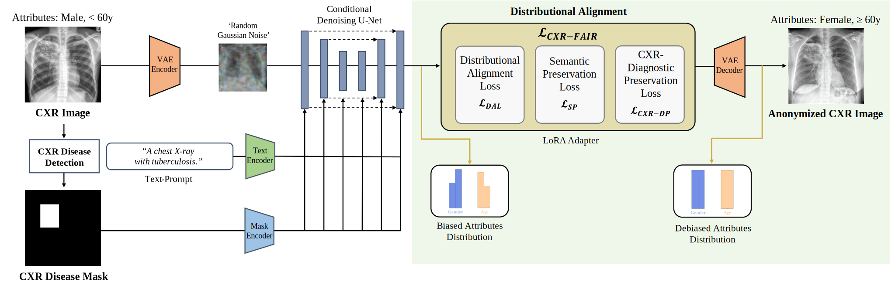
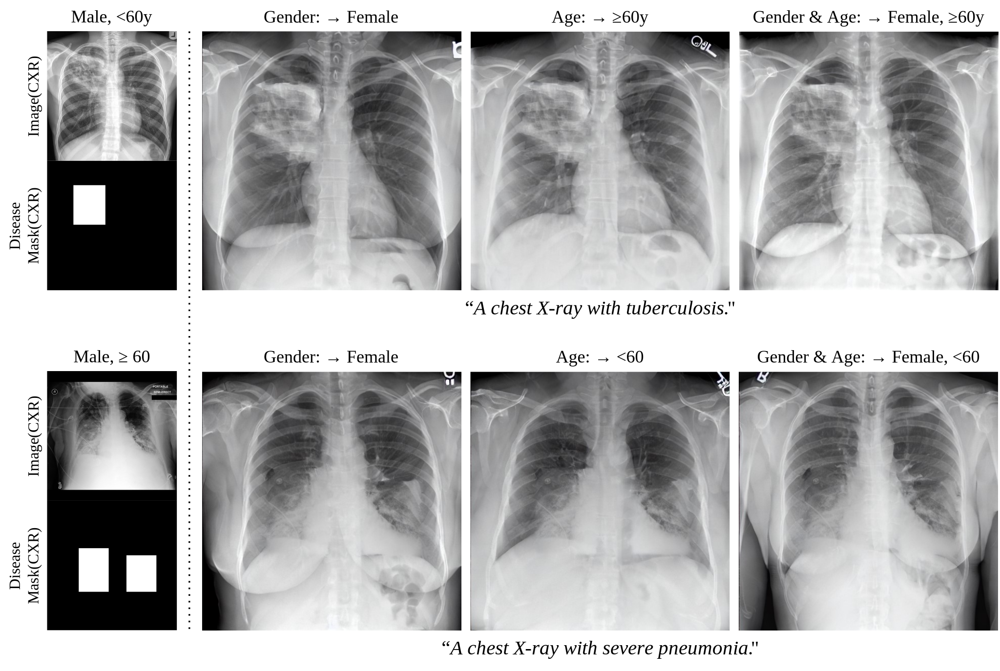

# CXR-AnoFAIR
CXR-AnoFAIR: Mitigating Attribute Bias in Chest Radiograph Anonymization using Stable Diffusion

This repository contains the implementation of the following paper:


<br>

## :open_book: Overview
<!--  -->


**CXR-AnoFAIR** presents example results of CXR anonymization with attribute bias mitigation.

<!--  -->


We propose **CXR-AnoFAIR**, a novel framework for chest radiograph anonymization that addresses both privacy and fairness concerns. The pipeline begins with disease region detection, then applies a Stable Diffusion inpainting model guided by our multi-component CXR-Fair loss function. This loss combines **_ℒDA_**(distributional alignment loss), **_ℒSP_**(semantic preservation loss), and our proposed **_ℒCXR-DP_**(CXR diagnostic preservation loss), working alongside a LoRA adapter to efficiently control demographic attributes while preserving diagnostic information.

<br>

## :heavy_check_mark: Updates
- [02/2025] [Codebase](https://github.com/i3a7h3/CXR-AnoFAIR) for CXR-AnoFAIR released.
- [02/2025] [Training code](https://github.com/i3a7h3/CXR-AnoFAIR) for Stable Diffusion Inpainting released.
- [02/2025] [Training code](https://github.com/i3a7h3/CXR-AnoFAIR) for bias mitigation released.

## :hammer: Setup

### Environment

```bash
conda create -n CXR-AnoFAIR python=3.10.13
conda activate CXR-AnoFAIR

git clone https://github.com/i3a7h3/CXR-AnoFAIR.git
pip install peft
pip install diffusers
pip install -r requirements.txt
```

<br>

## 🔍 Overview of Pipeline
Our framework consists of two main components:

(1) Stable Diffusion Inpainting: Fine-tuned to preserve diagnostic information in chest radiographs 

(2) Bias Mitigation: Using CXR-Fair Loss to ensure demographic fairness

For the initial disease region detection, we use YOLOv8 to identify pathological areas that should be preserved during the anonymization process. This step helps maintain the diagnostic utility of the radiographs while allowing the model to focus on anonymizing non-pathological regions.
<br>
<br>


## :running_man: Train

### 1. Train for the Inpainting Model

#### **Training with CXR Diagnostic Preservation Loss**

Our **CXR Diagnostic Preservation Loss** combines feature similarity, perceptual loss, and diagnostic consistency to ensure preservation of critical pathological information during anonymization.

___Note: It needs at least 24GB VRAM.___


```bash
export MODEL_NAME="stabilityai/stable-diffusion-2-inpainting"
export INSTANCE_DIR="path-to-cxr-dataset"
export OUTPUT_DIR="path-to-save-model"

accelerate launch ./train_cxr_inpaint.py \
  --pretrained_model_name_or_path=$MODEL_NAME  \
  --train_text_encoder \
  --instance_data_dir=$INSTANCE_DIR \
  --output_dir=$OUTPUT_DIR \
  --cxr_dp_weight=1.0 \
  --feature_weight=0.3 \
  --perceptual_weight=0.3 \
  --diagnostic_weight=0.4 \
  --instance_prompt="a chest x-ray showing [disease]" \
  --resolution=512 \
  --train_batch_size=1 \
  --use_8bit_adam \
  --gradient_checkpointing \
  --learning_rate=5e-5 \
  --lr_scheduler="constant" \
  --lr_warmup_steps=0 \
  --max_train_steps=50000
```

### **Important Args**

#### **General**

- `--pretrained_model_name_or_path` what model to train/initialize from
- `--instance_data_dir` path for CXR dataset that you want to train
- `--output_dir` where to save/log to
- `--instance_prompt` prompt template for training
- `--train_text_encoder` fine-tuning `text_encoder` with `unet` can give much better results

#### **Loss Components**

- `--cxr_dp_weight` Weight for the CXR Diagnostic Preservation Loss
- `--feature_weight` Weight for the feature similarity component
- `--perceptual_weight` Weight for the perceptual loss component
- `--diagnostic_weight` Weight for the diagnostic consistency component


### 2. Train for Bias Mitigation

Run the script below for training with CXR-Fair Loss for bias mitigation. 

```bash
export BASE_MODEL="path-to-baseline-model"
export TRAIN_DATA="path-to-training-data"
export OUTPUT_DIR="path-to-bias-mitigated-model"

accelerate launch ./train_bias_mitigation.py \
  --pretrained_model_name_or_path=$BASE_MODEL \
  --train_data_dir=$TRAIN_DATA \
  --output_dir=$OUTPUT_DIR \
  --mixed_precision="fp16" \
  --train_batch_size=4 \
  --gradient_accumulation_steps=2 \
  --max_train_steps=10000 \
  --checkpointing_steps=1000 \
  --learning_rate=1e-5 \
  --distributional_alignment_weight=1.0 \
  --semantic_preservation_weight=1.0 \
  --diagnostic_preservation_weight=1.0 \
  --feature_similarity_weight=0.3 \
  --perceptual_weight=0.3 \
  --diagnostic_consistency_weight=0.4 \
  --gradient_checkpointing \
  --use_8bit_adam \
  --lora_rank=8 \
  --resolution=512 \
  --seed="0"
```

### Important Args

#### **General**

- `--pretrained_model_name_or_path` what model to train/initialize from
- `--output_dir` where to save/log to
- `--seed` training seed (not set by default)

#### **CXR-Fair Loss Components**

- `--distributional_alignment_weight` Weight for the _ℒ<sub>DA</sub>_ component
- `--semantic_preservation_weight` Weight for the _ℒ<sub>SP</sub>_ component
- `--diagnostic_preservation_weight` Weight for the _ℒ<sub>CXR-DP</sub>_ component
- `--feature_similarity_weight` Weight for feature similarity
- `--perceptual_weight` Weight for perceptual loss
- `--diagnostic_consistency_weight` Weight for diagnostic consistency

#### **Optimizers/learning rates**

- `--max_train_steps` How many train steps to take
- `--gradient_accumulation_steps` Gradient accumulation for larger batch size
- `--train_batch_size` Batch size per GPU
- `--checkpointing_steps` How often to save model
- `--gradient_checkpointing` For memory optimization
- `--learning_rate` Learning rate
- `--lora_rank` LoRA adapter rank

<br>

## 📊 Evaluation

### Re-identification Rate

Evaluate privacy protection using the Siamese Neural Network method from PriCheXy-Net: [PriCheXy-Net repository](https://github.com/kaipackhaeuser/PriCheXy-Net).

### Attribute Classification

Attribute classification using the framework from AttrNzr: [AttrNzr repository](https://github.com/A-Big-Brain/Attribute-Neutralizer-for-medical-AI-system/tree/Fairness).

### Diagnostic Preservation

Evaluate clinical utility using TorchXRayVision: [TorchXRayVision repository](https://github.com/mlmed/torchxrayvision).

<br>

## ❤️ Acknowledgements

We thank the authors for their great work:
- [Fair Diffusion](https://github.com/sail-sg/finetune-fair-diffusion) for the distributional alignment techniques
- [AttrNzr](https://github.com/A-Big-Brain/Attribute-Neutralizer-for-medical-AI-system/tree/Fairness) for attribute bias mitigation methods
- [PriCheXy-Net](https://github.com/kaipackhaeuser/PriCheXy-Net) for pioneering CXR anonymization techniques
- [TorchXRayVision](https://github.com/mlmed/torchxrayvision) for CXR disease classification
- [HuggingFace Diffusers](https://github.com/huggingface/diffusers) for the Stable Diffusion implementation
